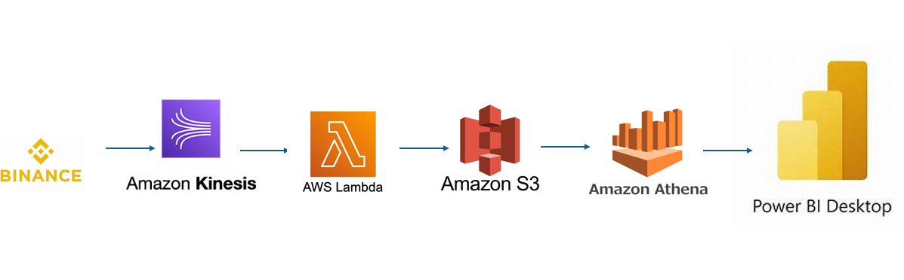
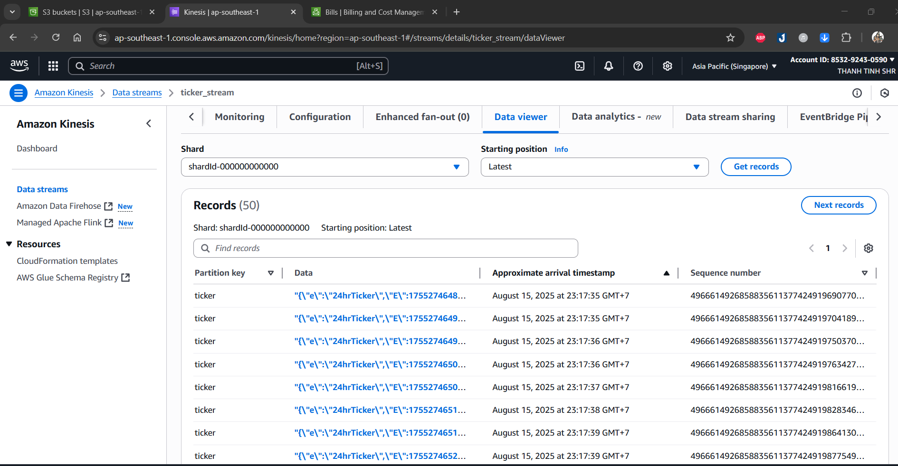
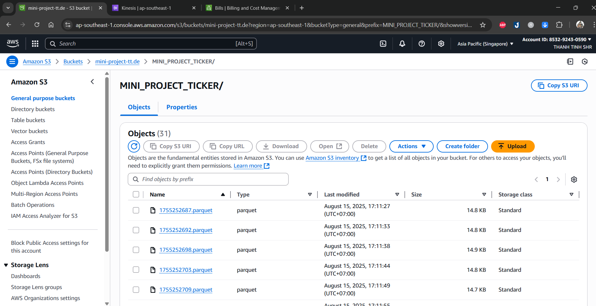
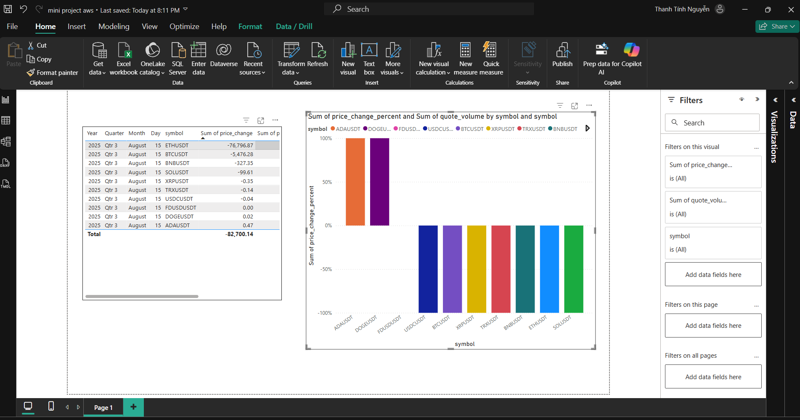

# Mini Project Binance Stream - AWS: Real-time Crypto Data Pipeline

A mini project that demonstrates a **cloud-native real-time data pipeline**.  
It streams data from **Binance WebSocket**, processes it with **AWS services**, and visualizes insights in **Power BI Desktop**.  

⚡ **Note**: This project is designed to run entirely on **AWS Free Tier services**, making it cost-effective for learning and experimentation.  

## 📚 Table of Contents
- [Overview](#overview)
- [Technologies Used](#technologies-used)
- [Features](#features)
- [System Architecture](#system-architecture)
- [Screenshots](#screenshots)
- [Contact](#contact)

## 📌 Overview

- **Project**: Binance Stream - AWS  
- **Purpose**: Build a real-time crypto streaming pipeline on AWS cloud  
- **Architecture**: Event-driven, serverless data pipeline  
- **Data Flow**: Binance WebSocket → AWS Kinesis → AWS Lambda → AWS S3 → Athena → Power BI  

---

## 🛠️ Technologies Used
- **Binance WebSocket API**: Real-time market data source  
- **AWS Kinesis Data Stream**: Streaming ingestion layer  
- **AWS Lambda**: Serverless consumer for data transformation & normalization  
- **Amazon S3**: Data lake for storage  
- **Amazon Athena**: Query service over S3  
- **Power BI Desktop**: Business Intelligence visualization  
- **Python**: Producer & Lambda code  
- **Pandas**: Data transformation and normalization inside Lambda  
---

## 🚀 Features
- **Real-Time Ingestion**: Capture live Binance market data.  
- **Serverless Transformation**: Normalize data with AWS Lambda.  
- **Data Lake Storage**: Store clean data in S3 (JSON/Parquet).  
- **SQL Analytics**: Query structured data with Athena.  
- **Visualization**: Build dashboards in Power BI Desktop.  
- **Cloud-Native**: Fully managed by AWS, no manual deployment required.  

---

## 🧱 System Architecture
Below is a high-level overview of the system architecture:

---

## 📸 Screenshots
- Example Kinesis data:  
    
- S3 Data Lake:  
    
- Power BI Dashboard:  
    

## 📬 Contact
If you have any questions or suggestions, feel free to reach out:

- **Email**: thanhtinh.de@gmail.com  
- **Phone**: 0899986747  
- **ZALO**: 0356657722  
